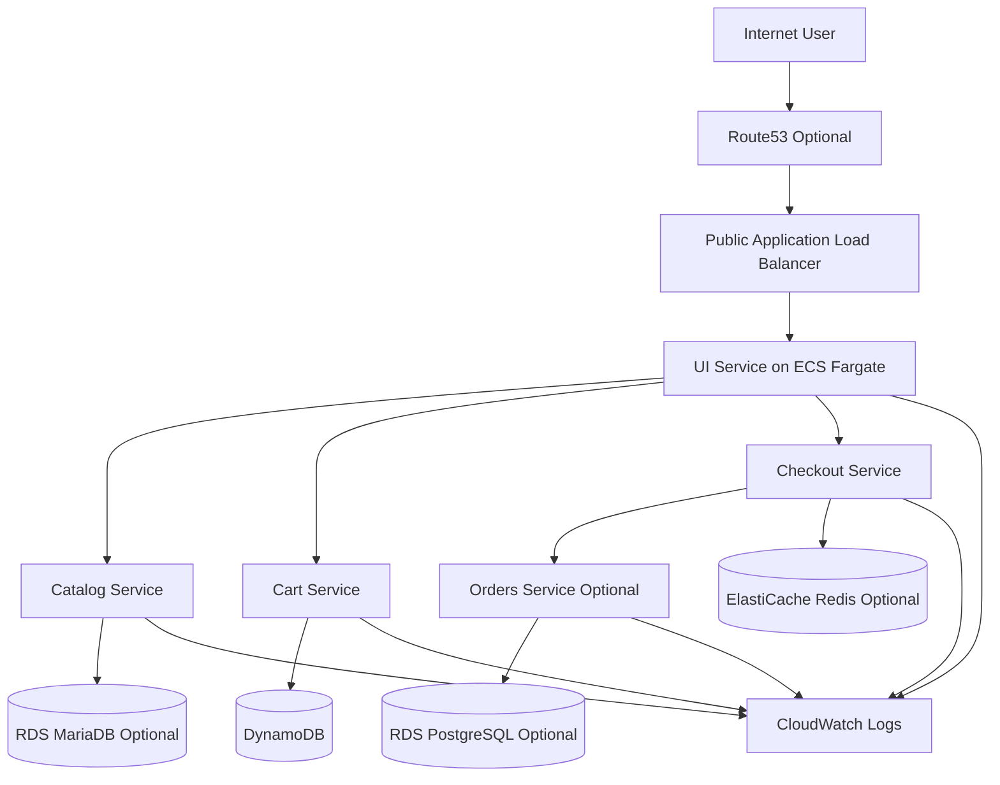

# Architecture

## Goal

The platform is designed to productionize the AWS retail sample on ECS Fargate without exposing internal services publicly.

The architectural baseline follows the Medium article:

- public ALB
- private ECS services
- clear IAM role separation
- optional stateful dependencies
- rolling deployment with rollback

## Logical flow

## Network layout

Public layer:

- internet-facing ALB
- optional Route53 DNS
- optional ACM-backed HTTPS
- optional WAF

Private layer:

- ECS Fargate tasks in private subnets
- optional RDS in private subnets
- optional ElastiCache in private subnets
- optional Cloud Map namespace for service discovery

Key rules:

- only ALB is public
- ECS tasks do not get public IPs
- backend services are private-only
- east-west traffic flows through controlled security groups

## Service topology

### UI

- public entry point
- registered in ALB target group
- calls backend services through private service discovery or private networking

### Catalog

- product catalog API
- can run with in-memory mode in lower environments
- can use RDS in higher environments

### Cart

- stores customer carts
- uses DynamoDB

### Checkout

- orchestrates checkout flow
- can use in-memory mode in lower environments
- can use Redis in higher environments

### Orders

- optional full-mode service
- can run in-memory in lower environments
- can use PostgreSQL in higher environments

## Environment strategy

### Dev

Target:

- cost-aware tutorial or test environment

Defaults:

- single NAT gateway
- fewer optional dependencies enabled
- smaller task sizes
- lower autoscaling ceilings
- shorter log retention

### Prod

Target:

- high-availability public environment

Defaults:

- per-AZ NAT gateway strategy
- desired count `>= 2` for customer-facing services
- optional stateful dependencies enabled
- Multi-AZ data path options
- WAF and HTTPS-ready posture

## Deployment architecture

The deployment model is intentionally ECS rolling deployment first, not blue/green by default.

Key settings:

- one ECS service per application component
- one task definition family per component
- image tags based on Git SHA
- `minimumHealthyPercent = 100`
- `maximumPercent = 200`
- deployment circuit breaker enabled
- rollback enabled

Deployment sequence:

1. build image
2. push image to ECR
3. register new task definition revision
4. update ECS service
5. wait for steady state
6. run smoke test
7. roll back if needed

## Availability model

Platform HA expectations for prod:

- at least two subnets across two AZs
- public ALB spanning multiple subnets
- UI desired count of at least 2
- backend desired counts sized for rolling deployment without outage
- optional Multi-AZ RDS
- optional Redis failover

The architecture is intentionally tolerant of dev using lighter settings while keeping the same Terraform root.

## Cost model

Primary cost drivers in this architecture:

- Fargate runtime
- NAT gateways
- ALB
- RDS
- ElastiCache
- CloudWatch log retention

Cost controls:

- dev disables optional services where possible
- shared Terraform root with environment tfvars prevents duplicated infra code
- ECR lifecycle reduces image storage growth
- VPC endpoints can reduce NAT egress dependency

## Outputs that feed operations

The Terraform root exposes outputs used by operators and workflows:

- ALB DNS / application URL
- ECS cluster name
- ECS service names
- ECS task definition families
- ECR repository URLs

These outputs are intended to feed GitHub repository variables and operator setup steps documented in the root README.
