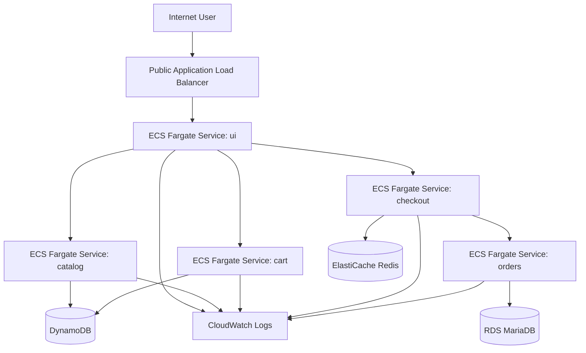

# Architecture

## Summary

The stack is designed around a public entry point for the `ui` service and private east-west traffic for all backend services.

## Diagram placeholder

## Network model

- ALB in public subnets
- ECS tasks in private subnets
- no public IPs on tasks
- internal services reachable only through private networking
- optional Cloud Map namespace for service discovery

## Deployment model

- one ECS service per application component
- one task definition per component
- immutable image tags derived from Git SHA
- circuit breaker rollback enabled

